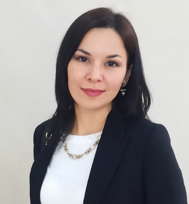

---
hide:
  - toc
---

# Камилла Винокурова

## Ведущий технический писатель / Lead Technical Writer

Более 10 лет занимаюсь разработкой технической и пользовательской документации для программного обеспечения, программно-аппаратных комплексов и телекоммуникационного оборудования.

Участвую в документационном сопровождении продукта на всех этапах жизненного цикла: от разработки и испытаний до сертификации, вывода на рынок, эксплуатации и дальнейшего развития.
 

Проектирую структуру документации и баз знаний, внедряю single-source подход, организую процессы подготовки, публикации и актуализации документации.

Работаю как с русскоязычной, так и с англоязычной документацией. В портфолио представлены проекты и примеры работ, не подпадающие под ограничения NDA.

### Ключевые компетенции

* Проектирование структуры документации и баз знаний
* Построение документационных процессов
* Single-source documentation
* Базы знаний и онлайн-документация
* Пользовательская и техническая документация
* Документация для сертификации продукции
* Технические статьи и технические решения
* Англоязычная документация

### Специализация

* Промышленное телекоммуникационное оборудование
* Программно-аппаратные комплексы
* Программное обеспечение
* Системы мониторинга и IoT

