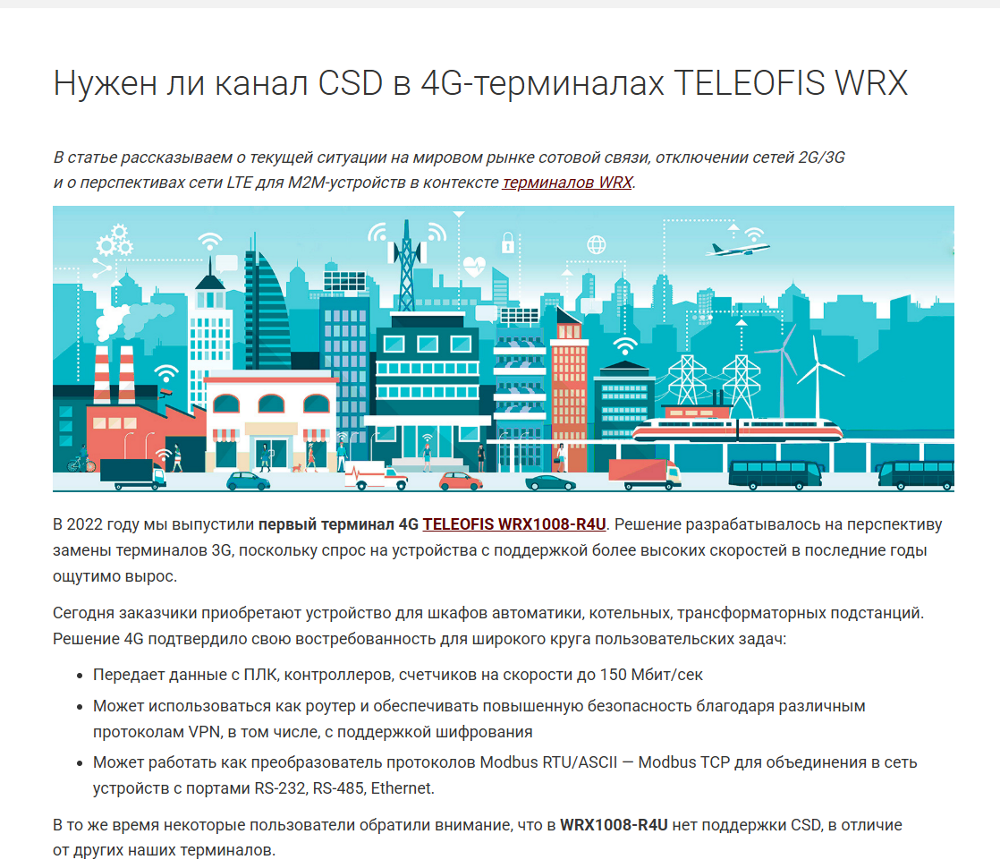
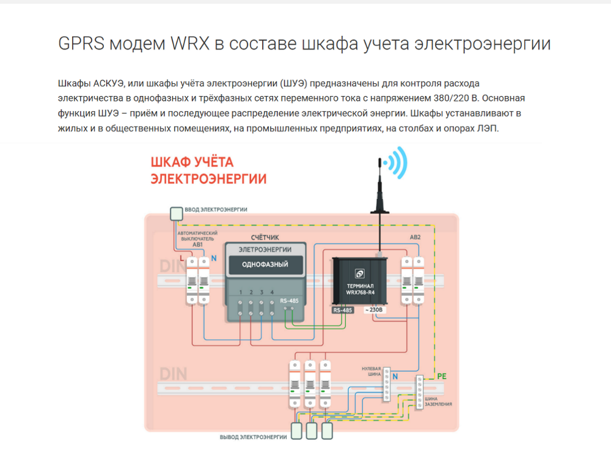
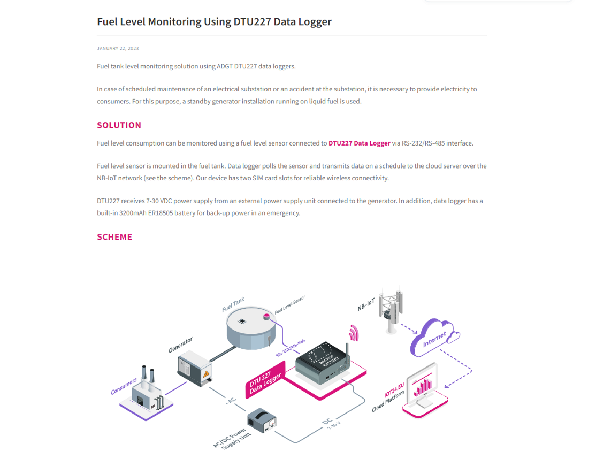
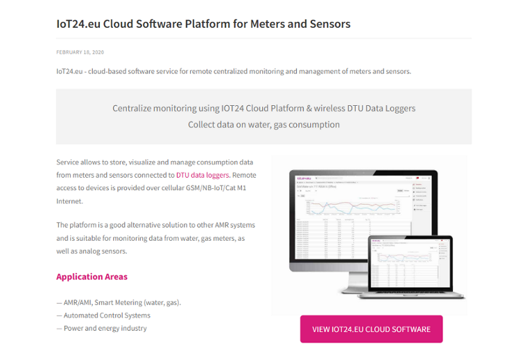
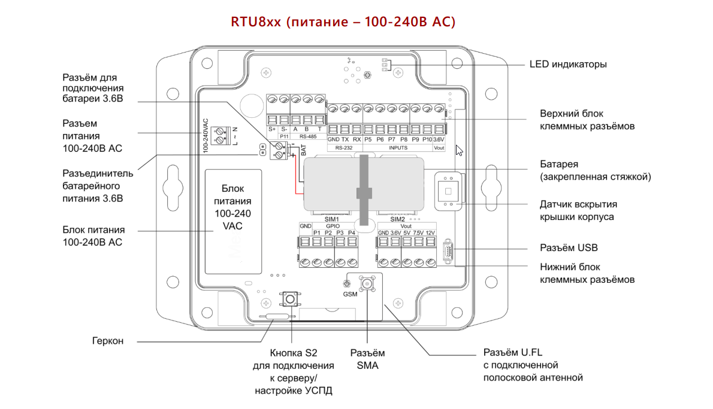
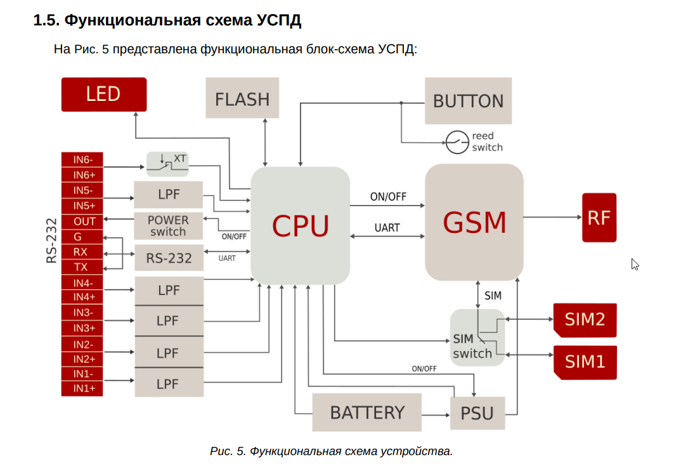
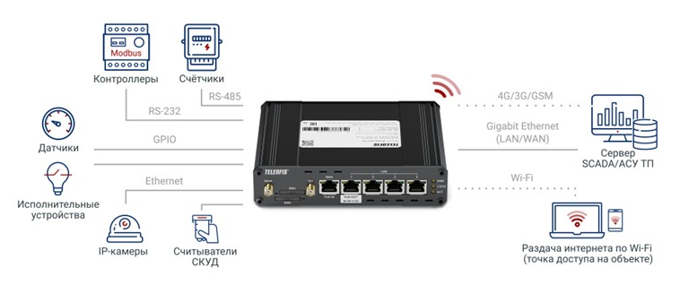

---
hide:
  - toc
---

# Технические статьи и схемы

<h2>Статья "Нужен ли канал CSD в 4G-терминалах TELEOFIS WRX"</h2>

  

    

      В статье рассматриваются перспективы технологий 2G, 3G и LTE, особенности технологии CSD и влияние этих изменений на промышленное оборудование для удалённого мониторинга и автоматизации.
    

    
<strong>Мой вклад:</strong>

    <ul>
      <li>Анализ российских и зарубежных отраслевых материалов.</li>
      <li>Анализ нормативных документов и программ развития сетей связи.</li>
      <li>Подготовка текста и адаптация технической информации для ЦА.</li>
      <li>Постановка задачи на подготовку иллюстраций.</li>
    </ul>
    

      <a class="article-link" href="https://teleofis.ru/blog/tekhnologii/nuzhen-li-kanal-csd-v-4g-terminalakh-wrx/"
         target="_blank">
        Открыть статью ↗
      </a>
    

  

  

    
  

<h2>Статья "GPRS-модем в составе шкафа учета электроэнергии"</h2>

  

    

      Статья посвящена организации удалённого сбора данных в системах АСКУЭ с использованием GPRS-модема в составе шкафа учёта электроэнергии. 
    

    
<strong>Мой вклад:</strong>

    <ul>
      <li>Подготовка технического контента и описания решения.</li>
      <li>Разработка исходной технической схемы подключения оборудования.</li>
      <li>Постановка задачи дизайнеру на создание финальной иллюстрации.</li>
      <li>Подготовка материала для целевой аудитории проекта.</li>
    </ul>

  

      <a class="article-link" href="https://teleofis.ru/blog/uchet-energoresursov/uchet-elektroenergii/gprs-modem-v-sostave-shkafa-ucheta-elektroenergii/"
         target="_blank">
        Открыть статью ↗
      </a>
    

  

  

    
  

<h2>Статья "Fuel Level Monitoring Using DTU227" (EN)</h2>

  

    

      Статья посвящена решению для удалённого мониторинга уровня топлива на объектах энергетической инфраструктуры с использованием даталоггера DTU227 и сети NB-IoT.
    

    
<strong>Мой вклад:</strong>

    <ul>
      <li>Подготовка технического контента на английском языке.</li>
      <li>Описание архитектуры решения и принципов передачи данных.</li>
      <li>Подготовка требований к технической иллюстрации и схеме решения</li>
    </ul>
    

      <a class="article-link" href="https://adgt.cz/resources/solutions/fuel-level-monitoring-using-dtu227-data-logger/"
         target="_blank">
        Открыть статью ↗
      </a>
    

  

  

    
  

<h2>Статья "IoT24.eu Cloud Software Platform for Meters and Sensors" (EN)</h2>

  

    

      Статья посвящена облачной платформе Iot24.eu для централизованного мониторинга, анализа и управления данными, поступающими от счётчиков и датчиков через устройства беспроводной передачи данных.
    

    
<strong>Мой вклад:</strong>

    <ul>
      <li>Подготовка технического контента на английском языке.</li>
      <li>Разработка структуры материала и верстка страницы в CMS сайта.</li>
      <li>Подготовка иллюстративных материалов. Создание набора тематических иконок.</li>
      <li>Постановка ТЗ дизайнеру на разработку технической схемы.</li>
      <li>Публикация материала на корпоративном сайте.</li>
    </ul>
    

      <a class="article-link" href="https://adgt.cz/resources/iot-software/iot24-cloud-monitoring-software-for-meters-and-sensors/"
         target="_blank">
        Открыть статью ↗
      </a>
    

  

  

    
  

<h2>Примеры технических схем</h2>

Ниже представлены примеры технических схем, подготовленных мной для статей, проектной документации и постановки задач на разработку финальных иллюстраций.

  

    
    

      Конструктив устройства и назначение компонентов
    

  

    
    

      Функциональная блок-схема устройства
    

  

  

    
    

      Типовая схема подключения для роутера
    

  

  

    
    

      Схема подключения через выделенный APN
    

  

 

  

    
    

      Габаритный чертёж устройства
    

  

   

    
    

      Схема шкафа учета электроэнергии
    

  

