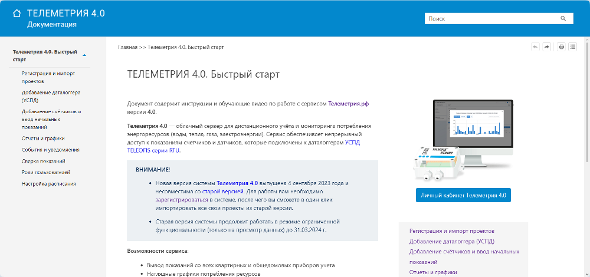
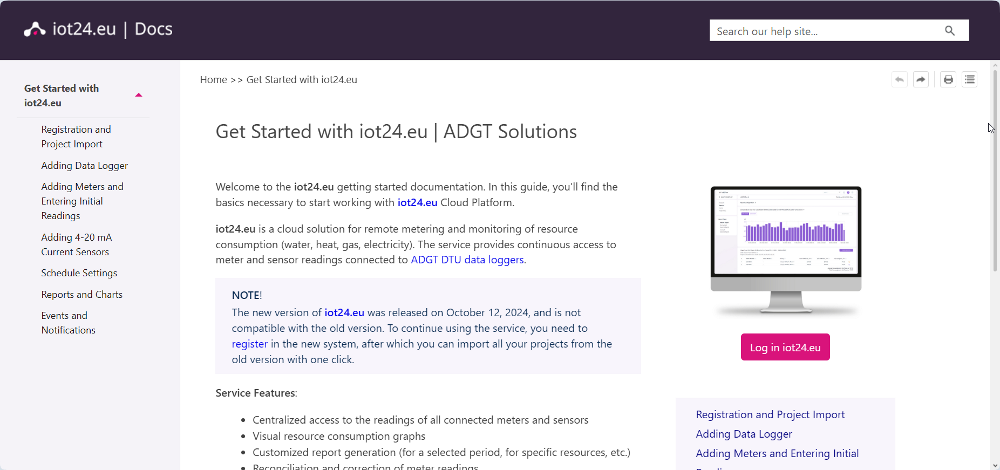
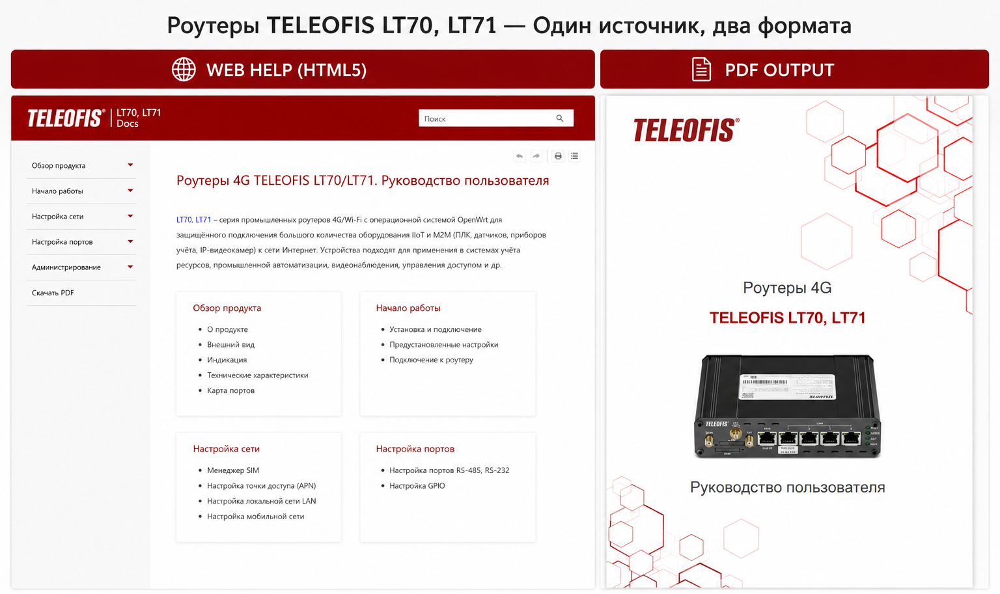
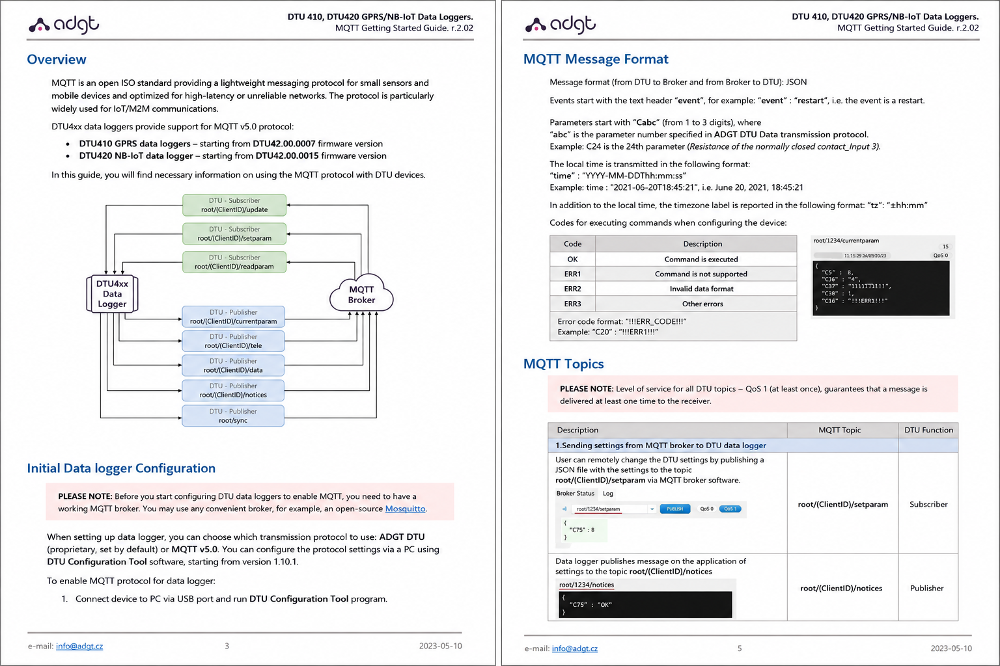

---
hide:
  - toc
---

# Руководства пользователя на ПО и оборудование

<!-- Телеметрия -->

<h3> Телеметрия.рф   Руководство пользователя (RU)</h3>

Веб-руководство пользователя для системы удаленного учета ресурсов Телеметрия.рф.

Разработала структуру документации, подготовила контент, видеоинструкции и организовала публикацию в MadCap Flare.

    MadCap Flare
    SnagIt
    Adobe Premiere Pro

<a href="https://teleofis.ru/docs/telemetriya_4.0/Content/telemetriya_4.0_quick_start.htm"
   target="_blank"
   class="project-link">
   Открыть документацию ↗
</a>

<!-- IoT -->

<h3> IoT24.eu  User Guide (EN)</h3>

English-language web user guide for a cloud platform for remote monitoring and utility metering. 

Developed the documentation structure, created content and maintained the help system in MadCap Flare.

    MadCap Flare
    SnagIt
    English Documentation

<a href="https://adgt.cz/wiki/iot24.eu/Content/iot24.eu_quick_start.htm"
   target="_blank"
   class="project-link">
   Открыть документацию ↗
</a>

<!-- Роутеры LT7x -->

<h3> Роутеры 4G TELEOFIS LT7x  Руководство пользователя (RU)</h3>

Веб- и PDF-документация для серии промышленных роутеров TELEOFIS LT7x.

Спроектировала single-source-архитектуру в MadCap Flare для публикации документации в различных форматах из единого проекта.

    Single Source
    Web & PDF
    Reusable Content

<a href="https://teleofis.ru/docs/lt7x/Content/lt7x_manual.htm"
   target="_blank"
   class="project-link">
   Открыть документацию ↗
</a>

<!-- MQTT Get Started Guide for DTU4xx -->

<h3> DTU4xx Data Loggers  MQTT Get Started Guide (EN)</h3>

English-language guide describing MQTT integration for the ADGT DTU4x0 data logger series.

Developed document structure, prepared content and created MQTT architecture diagrams in draw.io.

    English Documentation
    IoT Protocols
    Technical Illustration

<a href="../../assets/pdf/dtu4x0-mqtt-guide-en.pdf"
   target="_blank"
   class="project-link">
   Открыть документацию ↗
</a>

